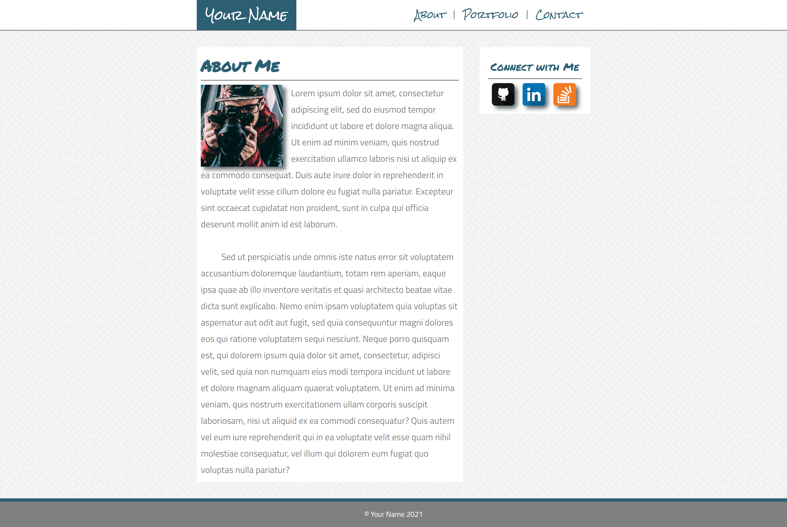

# Assignment 5: Create a Portfolio Webpage using HTML and CSS Float Layouts

(**NOTE:** View a rendered version of this file in VS Code with `ctrl-shift-v` or `cmd-shift-v`)

&nbsp;

&nbsp;
## Background

This assignment is designed to familiarize you with creating layouts using CSS floats, as well as creating a fully-styled website.

&nbsp;
## Setup

Create a git repository titled `m5-hw5-lastname-firstname` and clone the repo to your computer. Then, create an `index.html` file and `styles.css` file in the root of your `m5-hw5-lastname-firstname` folder. After adding `html`, `head`, and `body` tags, add a `link` tag to the `head` that links your `styles.css` file.

&nbsp;
## Instructions

1. Using [the included mockup](mockup-1920.png), create a portfolio website about yourself. Although the mockup looks like it has three total pages, you are only responsible for creating the home/about me page as depicted in the mockup.
1. In order to receive full-credit, your site must include:
    1. A header with your name and navigation links for "about", "portfolio", and "contact".
    1. A main content section with "about me" text that wraps around a profile image.
        * If you do not wish to use an image of yourself, [you may use a placeholder](https://pravatar.cc/).
        * You may use [lorem text](https://uhded.com/automatic-generate-lorem-vscode) for the site's copy if you wish instead of writing your own biographical info.
    1. A background pattern image applied behind the main content.
        * See [Subtle Patterns](https://www.toptal.com/designers/subtlepatterns/) or [Hero Patterns](https://www.heropatterns.com/) for free patterns.
    1. A sidebar to the right of the main text that includes social media icon links for [Stack Overflow](assets/soverflow.png), [LinkedIn](assets/linkedin.png), and [GitHub](assets/git.png)
    1. A footer at the bottom of the page that includes your name.
1. Your markup must use proper semantic tags.
1. Your site must be deployed to GitHub pages.

**NOTE**: Your site's design may deviate from the mockup with regards to colors and fonts. However, you must maintain the same layout as shown in the mockup.

&nbsp;
## Deployment

Your code must be deployed to GitHub Pages. To deploy a repository to GitHub pages you must:

1. Ensure your repository has an `index.html` file in the root directory.
1. Navigate to the `settings` section of the repository.
1. Click on `pages` in the left navigation menu.
1. Under `source` click the dropdown and select your `master` or `main` branch.
1. Click `save`.

Your site should be deployed to `<your github username>.github.io/<your repository name>` in 5-10 minutes.

&nbsp;
## Submission

Please submit both a link to your repository and a link to the live site. Also please include any comments on stumbling blocks or difficulties encountered while completing the assignment.

&nbsp;
## Resources

* [CSS Introduction on W3 Schools](https://www.w3schools.com/css/default.asp)
* [CSS Floats](https://www.w3schools.com/css/css_float.asp)